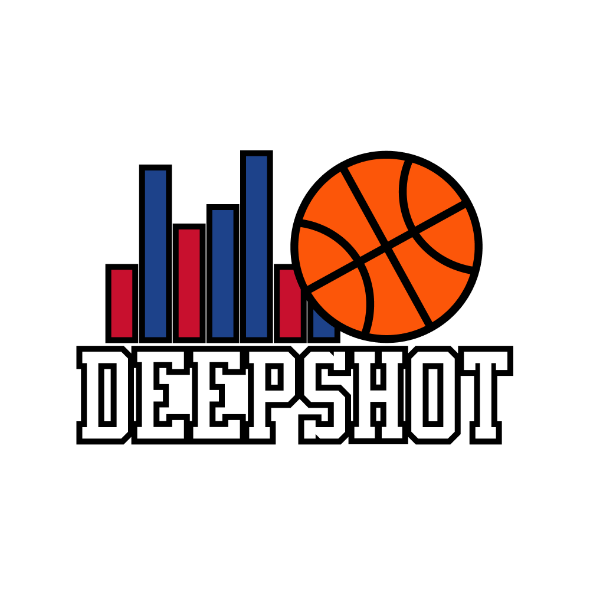
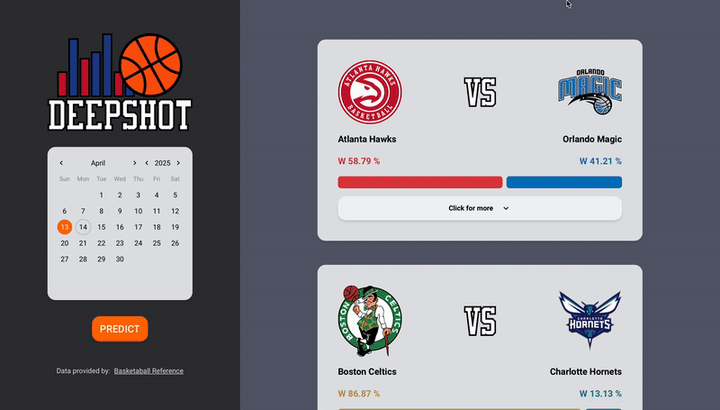

<div align="center">
  
  <h1>🏀 DeepShot: Predict NBA Games with Machine Learning</h1>
</div>

<div align="center">
  <a href="https://www.buymeacoffee.com/saccofrancesco">
    
  </a>
</div>

<h4 align="center">An advanced NBA game predictor powered by historical data from <a href="https://www.basketball-reference.com" target="_blank">Basketball Reference</a>, rolling statistics, and machine learning — built with <a href="https://nicegui.io" target="_blank">NiceGUI</a> for a seamless experience.</h4>

<p align="center">
  
  
  
</p>

<p align="center">
  <a href="#tldr">TL;DR</a> •
  <a href="#key-features">Key Features</a> •
  <a href="#quickstart">Quickstart</a> •
  <a href="#credits">Credits</a> •
  <a href="#license">License</a>
</p>

<div align="center">
  
</div>

---

## 📌 TL;DR
DeepShot is a machine learning-based NBA game predictor using advanced rolling stats (like EWMA) and real historical performance. It helps forecast matchups with visual insights and a clean interactive GUI.

---

## 💡 Why DeepShot Stands Out
- Uses **Exponentially Weighted Moving Averages (EWMA)** to capture recent form and momentum
- Visually highlights the **key statistical differences** between teams
- Clean, real-time **NiceGUI-powered web interface**
- Works **locally across platforms** (Windows, macOS, Linux)
- Based entirely on **free and public data**

---

## 🔑 Key Features
* **Data-Driven Predictions** – Powered by real NBA stats from [Basketball Reference](https://www.basketball-reference.com).
* **Real-Time Interface** – Visualize upcoming matchups and model predictions with a sleek NiceGUI web frontend.
* **Weighted Stats Engine** – Uses Exponentially Weighted Moving Averages ([EWMA](https://en.wikipedia.org/wiki/EWMA_chart)) to reflect recent performance trends.
* **Key Stat Highlighting** – Automatically surfaces differences between teams to help you identify strengths and weaknesses fast.
* **Cross-Platform Support** – Works smoothly on all major OSes.

---

## ⚡ Quickstart

```bash
git clone https://github.com/saccofrancesco/deepshot.git
cd deepshot
pip install -r requirements.txt
# Train model by running the notebook
# Open `model.ipynb` and run the cell to generate `deepshot.pkl`
python main.py  # Launches the NiceGUI web app
```

---

## 📬 Emailware: Share Your Thoughts

DeepShot is [emailware](https://en.wiktionary.org/wiki/emailware). If it helps you or you find it interesting, I’d love to hear from you!

Send feedback to: **[francescosacco.github@gmail.com](mailto:francescosacco.github@gmail.com)**

---

## 🙏 Love DeepShot? Support It!

If this project helped you or you just think it’s cool:

* ⭐️ Star the repo
* 🧃 [Buy me a coffee](https://www.buymeacoffee.com/saccofrancesco)
* 💌 Send your thoughts or suggestions by email

---

## 🧠 Credits & Acknowledgements

DeepShot uses the following awesome libraries:

* [Python](https://www.python.org/)
* [Basketball Reference](https://www.basketball-reference.com)
* [Requests](https://requests.readthedocs.io/en/latest/)
* [BeautifulSoup](https://www.crummy.com/software/BeautifulSoup/bs4/doc/)
* [Pandas](https://pandas.pydata.org)
* [Scikit-Learn](https://scikit-learn.org/stable/)
* [XGBoost](https://xgboost.readthedocs.io/en/release_3.0.0/)
* [NiceGUI](https://nicegui.io)

---

## 📎 You Might Also Like...

Check out more by the same author:

* [Supreme Bot](https://github.com/saccofrancesco/supremebot): A user-friendly Supreme bot built with [NiceGUI](https://nicegui.io) to help you buy Supreme items effortlessly.

---

## 📜 License

This project is licensed under the [MIT License](https://opensource.org/licenses/MIT) — feel free to use it in your own projects!

---

> GitHub [@saccofrancesco](https://github.com/saccofrancesco)