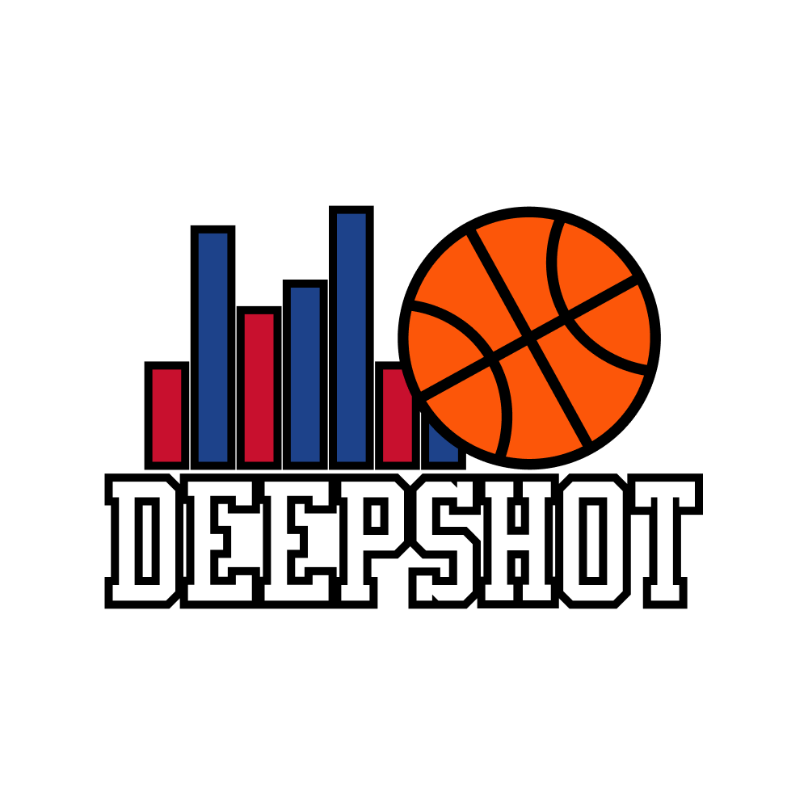

<div align="center">
  
  <h1>DeepShot: NBA Game Prediction Model</h1>
</div>

<h4 align="center">An advanced NBA game predictor powered by historical data - provided by <a href="https://www.basketball-reference.com" target="_blank">Basketball Reference</a> - rolling statistics and machine learning, built with <a href="https://nicegui.io" target="_blank">NiceGUI</a> for seamless interaction.</h4>

<p align="center">
  
  
  
</p>

<p align="center">
  <a href="#key-features">Key Features</a> •
  <a href="#how-to-use">How To Use</a> •
  <a href="#credits">Credits</a> •
  <a href="#license">License</a>
</p>

<div align="center">
  
</div>

## Key Features of DeepShot
* **Data-Driven Predictions** – Uses advanced rolling averages - provided by <a href="https://www.basketball-reference.com" target="_blank">Basketball Reference</a> - to predict game outcomes.
* **Real-Time Interface** - Visualize upcoming matchups and model predictions via a sleek web interface.
* **Weighted Stats Engine** – Calculates long-term form using Exponentially Weighted Moving Averages (<a href="https://en.wikipedia.org/wiki/EWMA_chart" target="_blank">EWMA</a>).
* **Key Stats Highlighting** - Displays the most important stats for both teams and automatically highlights those with the biggest differences, helping users quickly spot strengths and weaknesses.
* **Cross-Platform Support** – Runs smoothly on Windows, macOS, and Linux.

## How To Use Deepshot
Follow these steps to clone and run SupremeBot on your machine. You'll need [Git](https://git-scm.com) and [Python](https://www.python.org/downloads/) installed, along with [pip](https://pip.pypa.io/en/stable/).

1. Clone this repository:

```bash
$ git clone https://github.com/saccofrancesco/deepshot.git
```

2. Navigate into the repository:

```bash
$ cd deepshot
```

3. Install dependencies:

```bash
$ pip install -r requirements.txt
```

4. Run the "Model Training and Evaluation Workflow" cell in `model.ipynb`, to create the model file `deepshot.pkl`

5. Run the program:

```bash
$ python main.py
```

## Emailware: Share Your Thoughts
DeepShot is an [emailware](https://en.wiktionary.org/wiki/emailware). If you find this model helpful, I’d love to hear your feedback. Please email me at <francescosacco.github@gmail.com> to share your experience, thoughts, or suggestions!

## Credits & Acknowledgements
DeepShot uses the following open-source libraries:
- [Python](https://www.python.org/)
- [Basketball Reference](https://www.basketball-reference.com)
- [Requests](https://requests.readthedocs.io/en/latest/)
- [BeautifulSoup](https://www.crummy.com/software/BeautifulSoup/bs4/doc/)
- [Pandas](https://pandas.pydata.org)
- [Scikit-Learn](https://scikit-learn.org/stable/)
- [XGBoost](https://xgboost.readthedocs.io/en/release_3.0.0/)
- [NiceGUI](https://nicegui.io)

## You Might Also Like...
Explore more projects by the same author:
- [supreme-bot](https://github.com/saccofrancesco/supremebot): a user-friendly Supreme bot built with [NiceGUI](https://nicegui.io) to help you buy Supreme items effortlessly.

## License
This project is licensed under the Attribution-NonCommercial-ShareAlike 4.0 International License.

---
> GitHub [@saccofrancesco](https://github.com/saccofrancesco)
